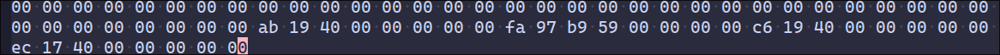
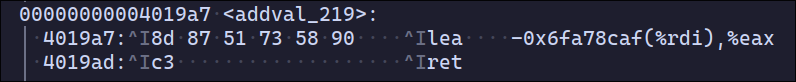
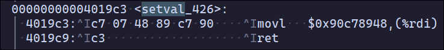

# CSAPP

## DataLab

主要是位运算，巩固位运算和数据的存储表示

## BombLab

非常有意思的一个lab，通过gdb调试汇编代码找到炸弹，涉及gdb调试、汇编、程序运行、数据存储与表示。phase_1-4基本没难度，5-6比较绕

- phase_5 根据输入的字符的ascii第二位映射到对应地址得到要求的明文
- phase_6 是最绕的一个，可以大致分为四个部分：
  - phase_6 - phase_6 + 93 :读取六个数字且必须为1-6且不能重复，不确定顺序
  - phase_6 + 95 - phase_6 + 128 :7减去输入的所有数字作为新的数字
  - phase_6 + 130 - phase_6 + 220 :将新的数字一一对应映射到存储在0x6032d0后的数字
  - phase_6 + 222 - phase_6 + end :映射后的数字必须逐个递减

## AttackLab

寒假闲着没事重新回来做，几个月不看x86的汇编都忘完了，之前看的书也忘的差不多了，csapp真是常看常新​(:dog:

lab分为两个部分，实现两种attack:

- 缓冲区溢出攻击
- ROP 攻击

1. 缓冲区溢出攻击，主要是通过代码注入

2. ROP攻击主要是利用已经存在的汇编代码让其实现不同解释实现攻击

ROP：

比如原来的addval_219函数从0x4019a7开始执行, 如果 让其从0x4019ab开始执行会产生不同解释，通过让ret跳转到函数的中间位置实现不同解释，再在buf中提前写入需要的值，使得多次ret实现需要的功能:(ret实质和pop一样是从栈顶取值，只不过pop赋值到指定寄存器，而ret是赋值到pc)



这里一共经过了两个gadget，先将值赋值到%rax，再赋值到%rdi，最后跳转到touch2



```asm
# 实际跳转后的汇编
4019ab: 58           popq  %rax      # 将cookie值赋给%rax
4019ac: 90           nop
4019ad: c3           ret             # 跳转到0x4019c6
```



```asm
# 实际跳转后的汇编
4019c6: 89 c7        movl %rax,%rdi  # 将cookie值赋给%rdi
4019c8: 90           nop
4019c9: c3           ret             # 跳转到touch2
```

## ArchLab

## CacheLab

## ShLab

